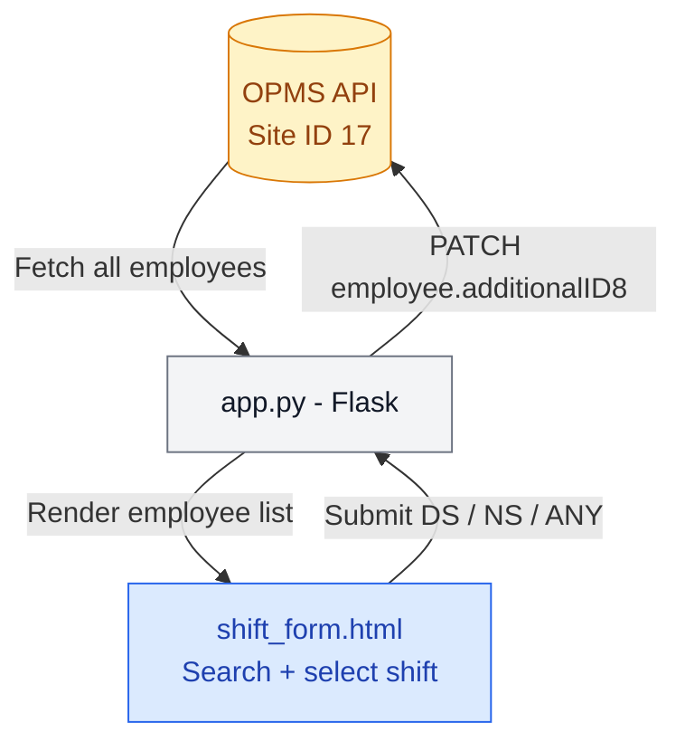

# Shift Preference for Shutdown Staff

An internal web tool for managing shift preferences (DS / NS / ANY) for shutdown employees. Loads employees directly from OPMS, lets users assign shifts, and writes selections back to OPMS via API.

## How it works



## Preview


## Features

- Search employee by full name
- Auto-fill Employee ID and Position from OPMS
- Select shift per employee — DS, NS, or ANY
- Submit multiple employees in one batch
- Writes shift back to OPMS `additionalID8` field via PATCH
- ASSETS team employees automatically excluded
- Mobile-friendly interface

## Tech Stack

- Python / Flask
- OPMS API (OAuth2 client credentials)
- Azure Web App
- GitHub Actions

```
## Project Structure
shift-preference/
├── app.py                  Flask app — fetch employees, handle submit, PATCH OPMS
├── templates/
│   └── shift_form.html     Search + shift selection form
└── requirements.txt
```

## Local Setup

Install dependencies:
pip install -r requirements.txt

Set environment variables:
OPMS_CLIENT_ID=your_client_id
OPMS_CLIENT_SECRET=your_client_secret

Run the app:
python app.py

## Azure Deployment

- Runtime: Python 3.11
- Startup command: `gunicorn app:app`
- Environment variables set in Azure App Service Configuration: `OPMS_CLIENT_ID`, `OPMS_CLIENT_SECRET`

## Rules

- Only valid shifts accepted: `DS`, `NS`, `ANY`
- ASSETS team employees are excluded from the list
